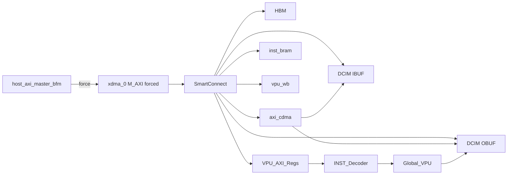
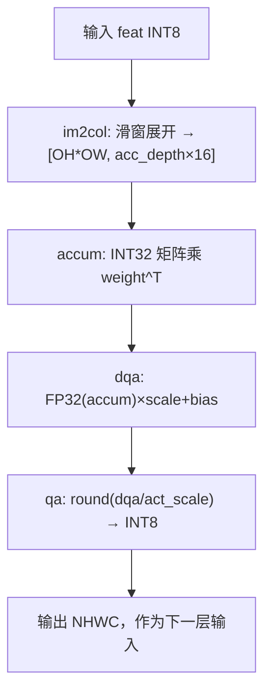

# lite Block Design 系统级仿真

在 Vivado 导出的 `lite` Block Design 上，用 VCS 仿真 **真实 HBM + axi_cdma + SmartConnect**，主机通过 **force `xdma_0/M_AXI`** 预加载数据并启动 `INST_Decoder`，跑 3 层 conv 指令链并与 golden 比对。

当前维护的 VPU/BD 联合仿真入口位于本目录及 `module_tb/`。

---

## 目录结构

```
rtl/tb/lite_bd/
├── README.md                 # 本文档
├── tb_lite_bd_e2e.sv         # 顶层 TB
├── host_axi_master_bfm.sv
├── lite_bd_hier.svh          # force 层次宏
├── lite_addrmap.svh          # 物理 AXI 地址
├── lite_xdma_constant_stub.v
├── data/                     # golden + hex / conv_manifest.svh
│   └── golden_conv_inst.py
└── sim/
    ├── run_bd_sim.sh         # 主入口
    ├── run_bd_sim_cases.sh
    ├── gen_bd_rtl_extra.sh
    ├── gen_bd_filelist.sh
    └── build_bd_sim/         # 运行产物（gitignore 建议）
```

导出产物（仓库根目录，不在 `tb/` 下）：

```
sim/lite_bd_export/vcs/lite/vcs/   # Vivado export_simulation
  lite.sh, synopsys_sim.setup, 各 IP 编译脚本
build/lite/                        # Vivado 工程与 IP sim wrapper
bd/lite/                           # BD 源与 sim/lite.v
```

---

## 仿真架构（数据流）



1. TB 用 BFM **force** 驱动 `lite_i/xdma_0_M_AXI_*`（PCIe 不仿真，`xdma_0` 仅提供 `axi_aclk` / `axi_aresetn`）。
2. 预加载：`hbm_image.hex` → HBM `@0`；`inst.hex` → `0x1_0300_0000`；`wb_init.hex` → `0x1_0200_0000`。
3. 写 `VPU_AXI_Regs` `@0x1_0400_0000` 启动 decoder（`inst_count`、`decoder_start`）。
4. 指令链：`CDMA` HBM→OBUF/IBUF → `im2col` → `CDMA` OBUF→IBUF → `DCIM` → `DQA` → `QA`（3 层）。
5. 用 BFM 读 OBUF 与 `L*_*.hex` golden 比对。

---

## 物理地址映射

与 `scripts/ip/bd/lite/address.tcl`、`lite_addrmap.svh` 一致：

| 区域 | 物理基址 | 大小 |
|------|----------|------|
| HBM | `0x0` | 模型容量见 IP |
| DCIM IBUF | `0x1_0000_0000` | 2MB |
| DCIM OBUF | `0x1_0100_0000` | 16MB |
| VPU WB | `0x1_0200_0000` | 32KB |
| INST BRAM | `0x1_0300_0000` | 128KB |
| VPU 寄存器 | `0x1_0400_0000` | 4KB |

OBUF 内各层 scratch 偏移见 `tb_lite_bd_e2e.sv` 中 `OB_L*` 常量（与 golden 中 OBUF 布局一致）。

---

## 一次性环境准备

### 1. Vivado 工程

需已存在 `build/lite/lite.xpr` 与 `bd/lite`（`scripts/chip-lite/0_build.tcl`、`1_bd.tcl`）。

### 2. Xilinx → VCS 仿真库

HBM、`axi_cdma`、SmartConnect 等 IP 需预编译进 `XILINX_VCS_LIB`：

```bash
cd /data/home/rn_xu29/Projects/YOLO-On-FPGA/EdgeYOLO-FPGA-lite
vivado -mode batch -source scripts/sim/compile_xilinx_vcs_lib.tcl
export XILINX_VCS_LIB=/data/home/rn_xu29/Tools/vcs_lib   # 按本机路径修改
```

### 3. 导出 BD 仿真文件（推荐）

```bash
vivado -mode batch -source scripts/chip-lite/export_sim.tcl
```

输出：`sim/lite_bd_export/vcs/lite/vcs/lite.sh` 与 `synopsys_sim.setup`。

也可在跑仿真时导出：

```bash
RUN_EXPORT=1 bash rtl/tb/lite_bd/sim/run_bd_sim.sh
```

---

## 详细仿真步骤（逐步命令）

以下假设仓库根目录为 `REPO`（请换成你本机路径）。**所有命令都在 `REPO` 下执行**，且终端里已能直接运行 `vivado`、`vcs`、`vlogan`、`python3`。

```bash
export REPO=/data/home/rn_xu29/Projects/YOLO-On-FPGA/EdgeYOLO-FPGA-lite
cd "$REPO"
```

---

### 阶段 0：检查前提（首次跑前做一次）

#### 命令 0-1：进入仓库

```bash
cd "$REPO"
pwd
```

**说明**：确认当前目录是 `EdgeYOLO-FPGA-lite` 根目录，后续相对路径才正确。

**期望**：`pwd` 打印的路径以 `EdgeYOLO-FPGA-lite` 结尾。

---

#### 命令 0-2：确认 Vivado 工程已生成

```bash
ls -l build/lite/lite.xpr bd/lite/lite.bd
```

**说明**：BD 仿真依赖已综合/实现的 `lite` 工程与 BD 源文件。若没有，需先跑 chip-lite 建工程（见下方「命令 1-0」）。

**期望**：两个文件都存在；若缺失会报 `No such file`。

---

#### 命令 0-3：确认 VCS 在 PATH

```bash
which vcs vlogan
vcs -ID
```

**说明**：`run_bd_sim.sh` 会调用 Synopsys VCS。若 `which` 无输出，需先 `module load` 或 `source` 你们 EDA 环境的 VCS 脚本。

**期望**：`which` 指向 VCS 安装目录；`vcs -ID` 打印版本信息。

---

#### 命令 0-4：确认 Python 依赖

```bash
python3 -c "import numpy; print('numpy OK')"
```

**说明**：生成 golden 需要 `numpy`；权重从当前 COCO `parsed_int8/weights/*.npz` 读取。

**期望**：打印 `numpy OK`。

---

### 阶段 1：一次性环境准备（每台机器 / 每个 Vivado 版本做一次）

#### 命令 1-0：（可选）从零建 Vivado 工程

仅当 **命令 0-2** 失败时执行；耗时较长（数十分钟级）。

```bash
cd "$REPO"
vivado -mode batch -source scripts/chip-lite/0_build.tcl
vivado -mode batch -source scripts/chip-lite/1_bd.tcl
```

**说明**：生成 `build/lite/lite.xpr` 与 `bd/lite/`。具体步骤以 `scripts/chip-lite/` 内 README 为准。

---

#### 命令 1-1：预编译 Xilinx IP → VCS 库

```bash
cd "$REPO"
vivado -mode batch -source scripts/sim/compile_xilinx_vcs_lib.tcl
```

**说明**：把 HBM、`axi_cdma`、SmartConnect 等 IP 的仿真模型编译进本地库。**只需做一次**（或升级 Vivado/VCS 后重做）。耗时约 **30–60 分钟**。

**期望**：Vivado 正常退出，无 `ERROR`；输出目录默认 `/data/home/rn_xu29/Tools/vcs_lib`（见 tcl 内 `out_dir`）。

**失败常见原因**：`compile_simlib` 参数与 Vivado 版本不匹配（本仓库 tcl 已按 2024.2 使用 `-directory`）。

---

#### 命令 1-2：设置 `XILINX_VCS_LIB`（每个新 shell 都要）

```bash
export XILINX_VCS_LIB=/data/home/rn_xu29/Tools/vcs_lib
ls "$XILINX_VCS_LIB/synopsys_sim.setup"
```

**说明**：VCS 通过该目录下的 `synopsys_sim.setup` 找到 `xilinx_vip`、`hbm` 等预编译库。路径必须与 **命令 1-1** 输出一致。

**期望**：`synopsys_sim.setup` 存在；`ls` 不报错。

---

#### 命令 1-3：设置 `VIVADO_HOME`（每个新 shell 都要）

```bash
export VIVADO_HOME=/home/EDAtools/Xilinx/Vivado/2024.2
ls "$VIVADO_HOME/data/ip/xilinx/floating_point_v7_1/hdl"
```

**说明**：浮点 IP 等 sim 模型路径由 `gen_bd_rtl_extra.sh` 引用。

**期望**：目录存在。

---

#### 命令 1-4：导出 BD 仿真文件（Vivado `export_simulation`）

```bash
cd "$REPO"
vivado -mode batch -source scripts/chip-lite/export_sim.tcl
```

**说明**：从 `build/lite/lite.xpr` 导出 VCS 用的 `lite.sh`、filelist、IP 编译脚本。BD 或 IP 有改动后需 **重新执行**。耗时约 **数分钟**。

**期望**：生成目录：

```text
sim/lite_bd_export/vcs/lite/vcs/lite.sh
sim/lite_bd_export/vcs/lite/vcs/synopsys_sim.setup
```

**检查**：

```bash
test -f sim/lite_bd_export/vcs/lite/vcs/lite.sh && echo "export OK"
```

---

### 阶段 2：仅生成 Golden（不跑 VCS，用于调试数据）

#### 命令 2-1：列出可用 case

```bash
cd "$REPO"
python3 rtl/tb/lite_bd/data/golden_conv_inst.py --case list
```

**说明**：打印 `default`、`bottleneck3x3`、`downsample`、`c3_deep` 等 3 层 conv 链说明。

**期望**：终端列出 case 名与对应 `network.json` 层名。

---

#### 命令 2-2：生成 default case 的全部 hex + 指令

```bash
cd "$REPO"
python3 rtl/tb/lite_bd/data/golden_conv_inst.py \
  --case default --scale 0.1 --verify-words 0 --bd-sim \
  --out-dir rtl/tb/lite_bd/data
```

**说明**：

| 参数 | 含义 |
|------|------|
| `--case default` | 使用 `E2E_CASES['default']` 三层 conv |
| `--scale 0.1` | 把 L1 空间尺寸缩到约 10%，加快仿真 |
| `--verify-words 0` | TB 对每个 checkpoint **全 tensor** 比对 |
| `--bd-sim` | 物理 CDMA 地址 + `hbm_image.hex` + HBM-first 指令 |
| `--out-dir` | 输出到 `rtl/tb/lite_bd/data/` |

**期望**：终端打印每层 `in/out` 尺寸与 `accum range`；`data/` 下出现 `inst.hex`、`hbm_image.hex`、`L1_*.hex` … `conv_manifest.svh`。

**检查**：

```bash
ls rtl/tb/lite_bd/data/inst.hex rtl/tb/lite_bd/data/hbm_image.hex rtl/tb/lite_bd/data/conv_manifest.svh
```

---

### 阶段 3：跑一次完整 BD 仿真（推荐入口）

下面 **3-1～3-3** 等价于一条 `run_bd_sim.sh`；脚本内部顺序与说明一致。

#### 命令 3-1：设置环境变量

```bash
cd "$REPO"
export XILINX_VCS_LIB=/data/home/rn_xu29/Tools/vcs_lib
export VIVADO_HOME=/home/EDAtools/Xilinx/Vivado/2024.2
```

**说明**：若已写入 `~/.bashrc` 可跳过；**每个新终端都要**保证这两个变量有效。

---

#### 命令 3-2：运行主仿真脚本

```bash
cd "$REPO"
bash rtl/tb/lite_bd/sim/run_bd_sim.sh
```

**说明**：一键完成 golden 生成 → 编译 → 运行。内部步骤与日志标题对应关系：

| 顺序 | 脚本打印的标题 | 实际动作 | 主要日志 |
|------|----------------|----------|----------|
| ① | `Generate golden` | 调用 `golden_conv_inst.py --bd-sim` | 终端 + 更新 `data/*.hex` |
| ② | `Compile lite BD` | `lite.sh -step compile` 编译 BD + Xilinx IP | `sim/build_bd_sim/export_compile.log` |
| ③ | `Vlogan user RTL` | `gen_bd_rtl_extra.sh` + vlogan DCIM/VPU | `vlogan_rtl_extra.log` |
| ④ | `Vlogan TB` | 编译 `tb_lite_bd_e2e.sv`、BFM | `vlogan_tb.log` |
| ⑤ | `VCS elaborate` | 链接 `tb_lite_bd_e2e` + `lite` + `glbl` | `compile.log` |
| ⑥ | `VCS simulate` | 运行 `build_bd_sim/simv` | **`sim.log`（判 PASS 看这个）** |

**耗时参考**：首次 **②** 最慢（可能 10–30+ 分钟）；**⑥** 取决于 `BD_SCALE` 与层尺寸（分钟级）。

**若尚未 export**，可让脚本先导出（等价于命令 1-4）：

```bash
RUN_EXPORT=1 bash rtl/tb/lite_bd/sim/run_bd_sim.sh
```

---

#### 命令 3-3：看仿真是否 PASS

```bash
echo "exit code = $?"
```

**说明**：上一条 `run_bd_sim.sh` 的退出码：**0 = PASS**，非 0 = FAIL。

**再看摘要**（脚本末尾已 grep 一部分，也可手动）：

```bash
grep -E 'compare |GRAND|ALL CHECKPOINTS|SOME CHECKPOINTS|BD VCS|FATAL' \
  rtl/tb/lite_bd/sim/build_bd_sim/sim.log | tail -30
```

**PASS 判据（需同时满足）**：

1. 终端最后一行：`BD VCS PASS (case=default)`
2. `sim.log` 中有：`ALL CHECKPOINTS PASSED`
3. `echo $?` 为 `0`

**FAIL 时**：打开 `sim.log` 搜 `MISMATCH` / `FATAL`，或看 `export_compile.log` / `vlogan_*.log` / `compile.log` 是否有 `Error`。

---

### 阶段 4：改参数再跑（可选）

#### 命令 4-1：换 case

```bash
BD_CASE=bottleneck3x3 bash rtl/tb/lite_bd/sim/run_bd_sim.sh
```

**说明**：只改 conv 链；仍会重新生成 golden 并全量编译（除非你自己改脚本做增量）。

---

#### 命令 4-2：快速冒烟（少比对字数，更快）

```bash
BD_CASE=default BD_SCALE=0.1 BD_VERIFY_WORDS=8 bash rtl/tb/lite_bd/sim/run_bd_sim.sh
```

**说明**：每个 checkpoint 只比前 **8** 个 128-bit word，用于确认通路，**不代表全 tensor 正确**。

---

#### 命令 4-3：跑完全部 4 个 case 回归

```bash
bash rtl/tb/lite_bd/sim/run_bd_sim_cases.sh
```

**说明**：依次跑 `default`、`bottleneck3x3`、`downsample`、`c3_deep`；每个 case 结束打印 `>>> CASE xxx: PASS/FAIL`，最后有 `OVERALL` 汇总。

**期望**：

```text
OVERALL: ALL CASES PASSED
```

**每 case 备份日志**：`rtl/tb/lite_bd/sim/build_bd_sim/sim_<case>.log`

---

### 阶段 5：分步手动跑（与 `run_bd_sim.sh` 等价，便于定位编译错误）

仅在自动脚本失败、需要逐步排查时使用。

#### 命令 5-1：生成 golden（同命令 2-2）

```bash
python3 rtl/tb/lite_bd/data/golden_conv_inst.py \
  --case default --scale 0.1 --verify-words 0 --bd-sim \
  --out-dir rtl/tb/lite_bd/data
```

---

#### 命令 5-2：仅编译 Vivado 导出的 BD + IP

```bash
cd "$REPO/sim/lite_bd_export/vcs/lite/vcs"
./lite.sh -lib_map_path "$XILINX_VCS_LIB" -step compile
```

**说明**：在 export 目录下编译 `xil_defaultlib.lite` 及 IP。成功则无 `Error-*` 退出。

---

#### 命令 5-3：编译用户 RTL（VPU/DCIM 等）

```bash
cd "$REPO"
BUILD=rtl/tb/lite_bd/sim/build_bd_sim
mkdir -p "$BUILD"
bash rtl/tb/lite_bd/sim/gen_bd_rtl_extra.sh "$BUILD/rtl_extra.f"

cd sim/lite_bd_export/vcs/lite/vcs
export SYNOPSYS_SIM_SETUP="$PWD/synopsys_sim.setup"
vlogan -full64 -sverilog +v2k \
  +incdir+$REPO/rtl/chip +incdir+$REPO/rtl/vpu \
  +incdir+$REPO/rtl/tb/lite_bd/data +incdir+$REPO/rtl/tb/lite_bd \
  +define+SIMULATION \
  -work xil_defaultlib -f "$REPO/$BUILD/rtl_extra.f" \
  -l "$REPO/$BUILD/vlogan_rtl_extra.log"
```

---

#### 命令 5-4：编译 TB

```bash
cd "$REPO/sim/lite_bd_export/vcs/lite/vcs"
mkdir -p vcs_lib/work
vlogan -full64 -sverilog +v2k \
  +incdir+$REPO/rtl/chip +incdir+$REPO/rtl/vpu \
  +incdir+$REPO/rtl/tb/lite_bd/data +incdir+$REPO/rtl/tb/lite_bd \
  +define+SIMULATION \
  -work work \
  $REPO/rtl/tb/lite_bd/lite_xdma_constant_stub.v \
  $REPO/rtl/tb/lite_bd/host_axi_master_bfm.sv \
  $REPO/rtl/tb/lite_bd/tb_lite_bd_e2e.sv \
  -l "$REPO/$BUILD/vlogan_tb.log"
```

---

#### 命令 5-5：Elaborate + 生成 simv

```bash
cd "$REPO/sim/lite_bd_export/vcs/lite/vcs"
vcs -full64 -debug_access+all \
  -ignore initializer_driver_checks \
  +notimingcheck +nospecify -t ps \
  work.tb_lite_bd_e2e xil_defaultlib.lite xil_defaultlib.glbl \
  -o "$REPO/$BUILD/simv" -l "$REPO/$BUILD/compile.log"
```

---

#### 命令 5-6：运行仿真

```bash
cd "$REPO/$BUILD"
ln -sf ../data/*.hex .
./simv +notimingcheck +nospecify 2>&1 | tee sim.log
```

**说明**：`simv` 工作目录下要有 `inst.hex`、`hbm_image.hex` 等（脚本用 symlink）。比对结果仍在 `sim.log` 末尾。

---

### 步骤总览（速查）

```text
[一次性]
  0-2 检查 lite.xpr
  1-1  compile_xilinx_vcs_lib.tcl
  1-2  export XILINX_VCS_LIB
  1-3  export VIVADO_HOME
  1-4  export_sim.tcl

[每次仿真]
  3-1  export 环境变量
  3-2  bash rtl/tb/lite_bd/sim/run_bd_sim.sh
  3-3  看 BD VCS PASS + sim.log + $?

[回归]
  4-3  bash rtl/tb/lite_bd/sim/run_bd_sim_cases.sh
```

---

## 运行 BD 仿真（速览）

完整逐步说明见上一节 **「详细仿真步骤」**。常用一条命令：

```bash
export XILINX_VCS_LIB=/data/home/rn_xu29/Tools/vcs_lib
export VIVADO_HOME=/home/EDAtools/Xilinx/Vivado/2024.2
bash rtl/tb/lite_bd/sim/run_bd_sim.sh
```

### 环境变量

| 变量 | 默认 | 含义 |
|------|------|------|
| `BD_CASE` | `default` | conv 链 case（`golden_conv_inst.py --case list`） |
| `BD_SCALE` | `0.1` | 空间缩放，加快仿真 |
| `BD_VERIFY_WORDS` | `0` | 每层 checkpoint 比对 128-bit 字数；`0`=全 tensor |
| `BD_MODE` | `fast` | `fast`=层级B，Host 直写 OBUF/IBUF，跳过 HBM 预加载；`hbm`=HBM-first，最接近硬件 |
| `SKIP_LITE_COMPILE` | `0` | `1` 时复用已有 export 编译结果，跳过 `lite.sh -step compile` |
| `RUN_EXPORT` | `0` | `1` 时先跑 `export_sim.tcl` |
| `XILINX_VCS_LIB` | （必填） | `compile_xilinx_vcs_lib.tcl` 输出目录 |
| `VIVADO_HOME` | Vivado 2024.2 | FP IP sim wrapper 路径 |
| `LITE_GEN` | `build/lite/lite.gen/sources_1/ip` | 浮点 IP sim 模型 |

兼容旧名：`E2E_CASE` / `E2E_SCALE` / `E2E_VERIFY_WORDS` 仍可作为别名。

### 多 case 回归

```bash
bash rtl/tb/lite_bd/sim/run_bd_sim_cases.sh
```

cases：`default`、`bottleneck3x3`、`downsample`、`c3_deep`。

### 快速冒烟（少比对字）

```bash
BD_MODE=fast BD_CASE=default BD_SCALE=0.1 BD_VERIFY_WORDS=8 bash rtl/tb/lite_bd/sim/run_bd_sim.sh
```

### HBM-first 完整路径（最接近硬件，较慢）

```bash
BD_MODE=hbm BD_CASE=default BD_SCALE=0.1 BD_VERIFY_WORDS=8 bash rtl/tb/lite_bd/sim/run_bd_sim.sh
```

`BD_MODE=fast` 仍使用导出的 lite BD、真实 SmartConnect/axi_cdma/VPU/DCIM；差异是 L1 输入和各层权重由 Host BFM 直接预加载到 OBUF/IBUF，跳过 HBM staging 与 HBM→片内的初始 CDMA copy。`BD_MODE=hbm` 保留原 HBM-first 指令和 `hbm_image.hex` 预加载，用于 sign-off。

---

## 如何判断 PASS / FAIL

仿真日志很长（Vivado IP + HBM + CDMA）。**不要盯全量 `sim.log`**，按下面顺序看即可。

### 单次 `run_bd_sim.sh`

| 位置 | 看什么 |
|------|--------|
| 终端末尾 | `run_bd_sim.sh` 会 `grep` 关键行；最后一行应是 **`BD VCS PASS (case=... mode=...)`** |
| 脚本退出码 | `echo $?` → **0 = PASS**，非 0 = FAIL |
| `sim/build_bd_sim/sim.log` 末尾 | **`ALL CHECKPOINTS PASSED`** 或 **`SOME CHECKPOINTS FAILED`** |
| 每个 checkpoint | `--- L1_im2col : N PASS, 0 FAIL ---` 等 12 行（3 层 × 4 阶段） |

失败时还会看到 `MISMATCH` / `FP MISMATCH`（每层最多打印前 8 处，见 TB 中 `FAIL_LOG_FIRST_N`）。

```bash
# 仅看判据（推荐）
grep -E 'compare |PASS,|FAIL ---|GRAND|ALL CHECKPOINTS|SOME CHECKPOINTS|FATAL|BD VCS' \
  rtl/tb/lite_bd/sim/build_bd_sim/sim.log | tail -30

# 或只看总结果
tail -5 rtl/tb/lite_bd/sim/build_bd_sim/sim.log
```

### 多 case `run_bd_sim_cases.sh`

每个 case 跑完后会打印 **`>>> CASE <name>: PASS`** 或 **`FAIL`**，并在该 case 的 checkpoint 摘要后结束。

全部跑完后有汇总表：

```text
==================== BD cases summary ====================
  default:PASS
  bottleneck3x3:PASS
  ...
OVERALL: ALL CASES PASSED
```

- **`OVERALL: ALL CASES PASSED`** 且退出码 0 → 四个 case 全过  
- 每个 case 的完整 log 备份在：`sim/build_bd_sim/sim_<case>.log`（例如 `sim_default.log`）

---

## Golden 运算流（`golden_conv_inst.py`）

Python 与 RTL 共用同一套 **3 层 conv 链** 语义：从 YOLOv5n 解析权重 + `network.json` 拓扑，空间维用 `--scale` 缩小以加快仿真，**算法路径与全尺寸一致**。

### 1. Case 与输入

```bash
python3 rtl/tb/lite_bd/data/golden_conv_inst.py --case list
```

| Case | 三层 conv（`network.json` 中的 name） |
|------|--------------------------------------|
| `default` | `model.1.conv` → `model.2.cv1.conv` → `model.2.m.0.cv2.conv` |
| `bottleneck3x3` | `model.2.m.0.cv1` → `cv2` → `cv1`（16ch bottleneck） |
| `downsample` | `model.2.cv3` → `model.3` → `model.4.cv1` |
| `c3_deep` | `model.3` → `model.4.cv3` → `model.4.cv2` |

每层从 `model/yolov5n_coco50k_qat/parsed_int8/weights/<layer>.npz` 读取：

- `weight_int8`：INT8 权重  
- `dqa_scale` / `dqa_bias`：每 OC 的 FP32 BN 参数  
- `act_scale`：该层输出对称量化尺度  

L1 输入：`np.random.seed(42)` 的 **对称 INT8** 特征图 `[H,W,C]`（非真实图片，固定可复现）。

`--scale`（默认仿真 `0.1`）把 case 里 `l1_full_hw` 缩到 ≥8 的偶数 H/W，再按 stride/pad 推导 L2/L3 的 `in_h/in_w`。

### 2. 每层 Python 前向（与硬件阶段一一对应）

对当前层输入 `feat_int8 [H,W,IC]`，`ConvLayer.forward()` 顺序为：



公式（与 `ConvLayer` 实现一致）：

| 阶段 | Golden 计算 | 对应硬件 |
|------|-------------|----------|
| **im2col** | 按 `kh,kw,stride,pad` 展开；无效位置填 0；列宽 `acc_depth×16` | VPU `im2col_unit` |
| **accum** | `im2col @ weight.reshape(OC,-1).T`，INT32 | DCIM INT8 模式，8 Tile |
| **dqa** | `accum_fp32 * dqa_scale[oc] + dqa_bias[oc]`，**无 ReLU** | VPU `dqa` + WB scale/bias |
| **qa** | `clip(round(dqa / act_scale), -128, 127)` | VPU `qa`；WB 写 `1/act_scale` 供硬件乘法 |

说明：硬件路径为 **im2col → DCIM → DQA → QA**，故意跳过 `NN_LUT`；golden 也不在 DQA 后做 ReLU，负值由 QA clamp 处理。

### 3. 生成的文件（`--bd-sim`）

`run_bd_sim.sh` 调用：

```bash
python3 rtl/tb/lite_bd/data/golden_conv_inst.py \
  --case <BD_CASE> --scale <BD_SCALE> --verify-words <N> --bd-sim
```

| 产物 | 用途 |
|------|------|
| `input_feat.hex` | L1 输入（也打进 `hbm_image.hex`） |
| `L{n}_im2col.hex` / `accum` / `dqa` / `output.hex` | TB 读 OBUF 后的 golden |
| `L{n}_weight_tile*.hex` | IBUF 权重 SRAM 布局（INT8 nibble pack） |
| `wb_init.hex` | DQA scale/bias + QA `1/act_scale` |
| `inst.hex` | `INST_Decoder` 指令流 |
| `hbm_image.hex` | HBM 预加载：输入 + 各层权重 |
| `conv_manifest.svh` | TB 的 `L*_CHK_*`、`E2E_VERIFY_WORDS` 等 |

### 4. 指令流（每层，与 RTL 执行顺序一致）

`build_layer_instructions()` 在 `--bd-sim` 下使用 **物理 AXI 地址**（`OBUF_PHY_BASE` / `IBUF_PHY_BASE` / `HBM_PHY_BASE`）：

1. **（仅 BD）HBM → OBUF/IBUF**：`CDMA_COPY` 搬 L1 feature；搬本层 weight tiles  
2. **im2col**：`OP_VPU_EXEC` unit=IM2COL，OBUF feature → OBUF im2col  
3. **CDMA**：OBUF im2col → IBUF `0x040000` activation scratch  
4. **DCIM**：`DCIM_CFG`（mode / wei_base / tile_mask）+ 逐 pixel `ACT_BASE`/`OUT_BASE` + `DCIM_EXEC`  
5. **DQA / QA**：`OP_VPU_EXEC`，读 OBUF accum/dqa，写 OBUF dqa/output  
6. 三层链结束后 `OP_END`

L2/L3 的输入 feature 已在链上前一层 QA 输出写入 OBUF，不再从 HBM 搬 feature。

### 5. TB 比对（仿真结束后）

`INST_Decoder` 跑完 `inst.hex` 后，BFM 经 AXI 读 **OBUF 物理地址** `0x1_0100_0000 + 层内偏移`，与 `L*_*.hex` 逐 128-bit word 比较：

| Checkpoint | Golden 文件 | 比对模式 |
|------------|-------------|----------|
| `L*_im2col` | `L*_im2col.hex` | 位精确 |
| `L*_accum` | `L*_accum.hex` | 位精确（INT32 打包布局与 `write_accum_hex` 一致） |
| `L*_dqa` | `L*_dqa.hex` | FP32 容差约 1% |
| `L*_output` | `L*_output.hex` | 位精确 INT8 |

`BD_VERIFY_WORDS`（或 `--verify-words`）控制每层每个 checkpoint 最多比对多少 **128-bit word**；`0` 表示该 tensor 全长比对。

---


## force 层次与调试

导出后若 `force` 路径报错，编辑 `lite_bd_hier.svh`，或仿真时覆盖：

```text
+LITE_BD_DUT=tb_lite_bd_e2e.dut +LITE_BD_XDMA_PREFIX=tb_lite_bd_e2e.dut.lite_i
```

常见问题：

| 现象 | 处理 |
|------|------|
| 缺少 `lite.sh` | 运行 `export_sim.tcl` |
| `hbm` / `axi_cdma` 未解析 | 检查 `XILINX_VCS_LIB` 是否含对应库 |
| `Global_VPU_top` 未定义 | 确认 `gen_bd_rtl_extra.sh` 已执行且无 vlogan 错误 |
| `axi_aresetn` 一直为 0 | TB 会 wait/force；检查 `timescale 1ps` 与 clock 周期 |
| 编译很慢 | 首次 `lite.sh -step compile` 正常；增量可只重跑 vlogan/vcs 段 |

无 export 目录时，可用 `gen_bd_filelist.sh` 生成备用 filelist（功能少于 `lite.sh` 流程，仅作兜底）。

---

## 相关脚本（仓库根）

| 脚本 | 作用 |
|------|------|
| `scripts/chip-lite/export_sim.tcl` | `export_simulation` → `sim/lite_bd_export/` |
| `scripts/sim/compile_xilinx_vcs_lib.tcl` | 预编译 Xilinx IP 到 VCS |
| `scripts/ip/bd/lite/address.tcl` | BD 地址分配源 |
